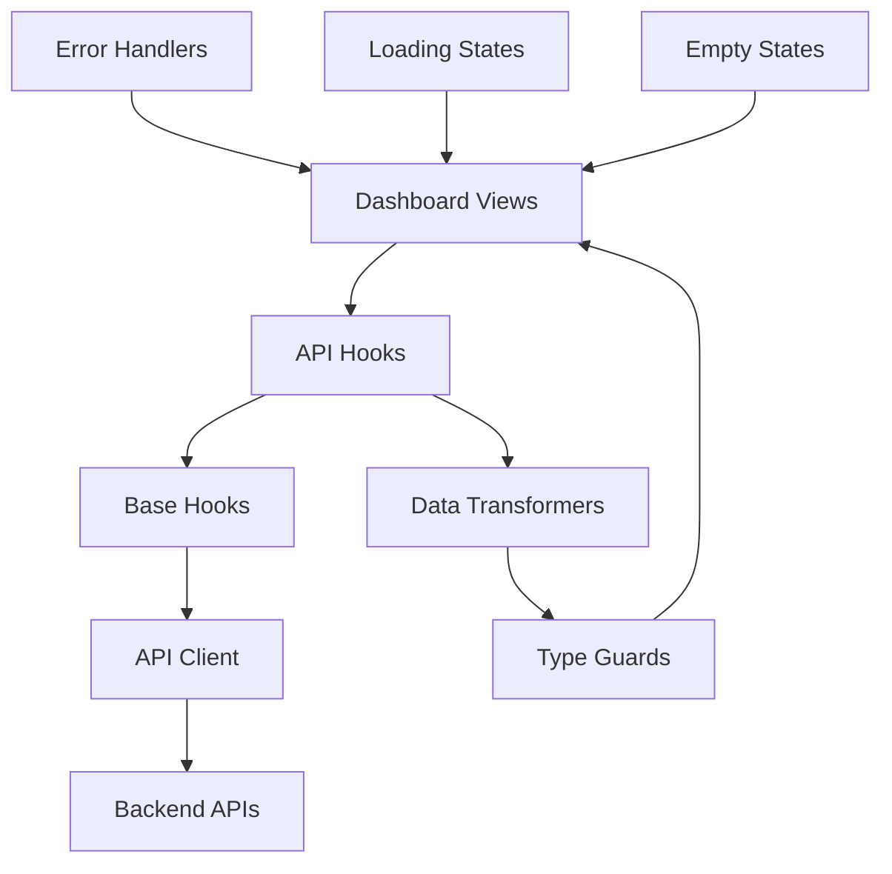
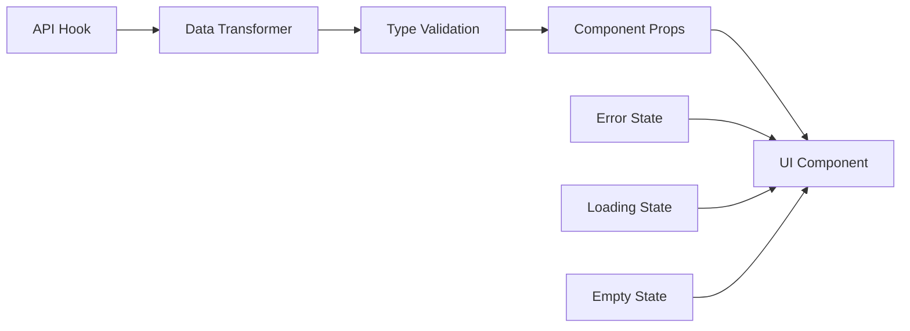

# Design Document

## Overview

This design addresses the integration issues between dashboard views and API responses by fixing TypeScript errors, standardizing data handling patterns, and ensuring consistent user experience across all views. The solution focuses on proper type safety, error handling, and data transformation to bridge the gap between API responses and UI component expectations.

## Architecture

### Data Flow Architecture



### Component Integration Pattern



## Components and Interfaces

### 1. Data Transformation Layer

**Purpose**: Transform API responses to match component expectations

**Key Components**:
- `NotificationDataTransformer`: Handles paginated notification responses
- `StationDataTransformer`: Converts station coordinates and status
- `RouteDataTransformer`: Processes route calculation responses
- `AddressDataTransformer`: Standardizes address/coordinate formats

**Interface**:
```typescript
interface DataTransformer<TInput, TOutput> {
  transform(input: TInput): TOutput;
  validate(input: unknown): input is TInput;
}
```

### 2. Enhanced API Hooks

**Purpose**: Provide transformed, type-safe data to components

**Key Enhancements**:
- Automatic data transformation
- Consistent error handling
- Standardized loading states
- Type-safe fallbacks

**Pattern**:
```typescript
export function useTransformedNotifications(params: PaginationQueryDto = {}) {
  const query = usePaginatedApiQuery<NotificationResponseDto>(...);
  
  return {
    ...query,
    data: query.data ? transformNotificationData(query.data) : undefined,
    notifications: query.data?.items || [],
    unreadCount: query.data?.items?.filter(n => !n.read).length || 0,
  };
}
```

### 3. Type Guards and Validators

**Purpose**: Ensure runtime type safety and provide meaningful error messages

**Key Functions**:
- `isValidCoordinates(value: unknown): value is Coordinates`
- `isValidPaginatedResponse<T>(value: unknown): value is PaginatedResponseDto<T>`
- `isValidStationData(value: unknown): value is ChargingStationResponseDto`

### 4. Error Boundary Components

**Purpose**: Graceful error handling with recovery options

**Components**:
- `ApiErrorBoundary`: Catches and displays API-related errors
- `DataErrorFallback`: Shows fallback UI when data is invalid
- `NetworkErrorHandler`: Handles network connectivity issues

## Data Models

### 1. Transformed Notification Data

```typescript
interface TransformedNotificationData {
  notifications: NotificationResponseDto[];
  unreadCount: number;
  totalCount: number;
  hasMore: boolean;
  pagination: {
    currentPage: number;
    totalPages: number;
    itemsPerPage: number;
  };
}
```

### 2. Enhanced Station Data

```typescript
interface EnhancedStationData extends ChargingStationResponseDto {
  coordinates: Coordinates; // Extracted from location.coordinates
  distanceFromUser?: number;
  availableConnectors: number;
  statusColor: 'green' | 'yellow' | 'red';
}
```

### 3. Standardized Address Format

```typescript
interface StandardizedAddress {
  name: string;
  coordinates: Coordinates;
  formattedAddress: string;
}
```

### 4. Route Calculation Result

```typescript
interface RouteCalculationResult {
  route: RouteResponseDto | null;
  isCalculating: boolean;
  error: string | null;
  statistics: {
    distance: string;
    duration: string;
    energyConsumption: string;
    estimatedCost: string;
    chargingStops: number;
  };
}
```

## Error Handling

### 1. Error Classification

```typescript
enum ErrorType {
  NETWORK_ERROR = 'network_error',
  VALIDATION_ERROR = 'validation_error',
  API_ERROR = 'api_error',
  TRANSFORMATION_ERROR = 'transformation_error',
}

interface ClassifiedError {
  type: ErrorType;
  message: string;
  originalError?: Error;
  retryable: boolean;
  userMessage: string;
}
```

### 2. Error Recovery Strategies

- **Network Errors**: Show retry button with exponential backoff
- **Validation Errors**: Display fallback data with warning
- **API Errors**: Show user-friendly message with support contact
- **Transformation Errors**: Log error and show raw data with warning

### 3. Error Boundaries

```typescript
interface ErrorBoundaryState {
  hasError: boolean;
  error: ClassifiedError | null;
  errorId: string;
}
```

## Testing Strategy

### 1. Unit Tests

**Data Transformers**:
- Test transformation logic with various API response formats
- Validate error handling for malformed data
- Ensure type safety with invalid inputs

**API Hooks**:
- Mock API responses and test data flow
- Test loading and error states
- Validate caching behavior

**Type Guards**:
- Test with valid and invalid data structures
- Ensure proper TypeScript narrowing
- Test edge cases and boundary conditions

### 2. Integration Tests

**Component Integration**:
- Test complete data flow from API to UI
- Validate error handling in real scenarios
- Test loading states and transitions

**API Integration**:
- Test with real API endpoints (if available)
- Validate data transformation accuracy
- Test error scenarios and recovery

### 3. End-to-End Tests

**User Workflows**:
- Test complete user journeys across all views
- Validate data consistency between views
- Test offline/online transitions

**Error Scenarios**:
- Test network failures and recovery
- Test invalid data handling
- Test concurrent operations

## Implementation Approach

### Phase 1: Core Infrastructure
1. Create data transformation utilities
2. Implement enhanced base hooks
3. Add type guards and validators
4. Set up error classification system

### Phase 2: Dashboard Integration
1. Fix notification data handling
2. Update dashboard page with transformed data
3. Implement consistent loading states
4. Add error boundaries

### Phase 3: Specialized Views
1. Fix map view coordinate handling
2. Update vehicle page data flow
3. Enhance wallet page transaction handling
4. Standardize address autocomplete

### Phase 4: Polish and Testing
1. Add comprehensive error handling
2. Implement retry mechanisms
3. Add loading skeletons
4. Write comprehensive tests

## Technical Decisions

### 1. Data Transformation Strategy
**Decision**: Transform data at the hook level rather than component level
**Rationale**: Centralized transformation ensures consistency and reusability

### 2. Error Handling Approach
**Decision**: Use error boundaries with classified errors
**Rationale**: Provides graceful degradation and better user experience

### 3. Type Safety Strategy
**Decision**: Runtime type validation with compile-time types
**Rationale**: Ensures both development-time and runtime safety

### 4. Loading State Management
**Decision**: Standardized loading components with skeleton screens
**Rationale**: Consistent user experience and better perceived performance

## Performance Considerations

### 1. Data Caching
- Implement intelligent cache invalidation
- Use optimistic updates where appropriate
- Cache transformed data to avoid re-computation

### 2. Bundle Size
- Tree-shake unused transformation utilities
- Lazy load error boundary components
- Minimize type guard overhead

### 3. Runtime Performance
- Memoize transformation results
- Use efficient data structures
- Minimize re-renders with proper dependency arrays