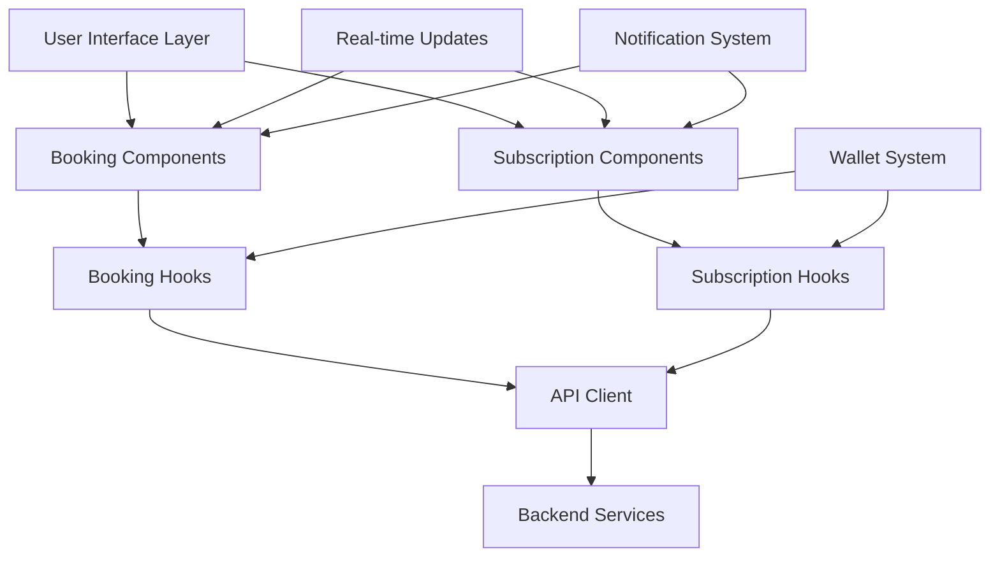
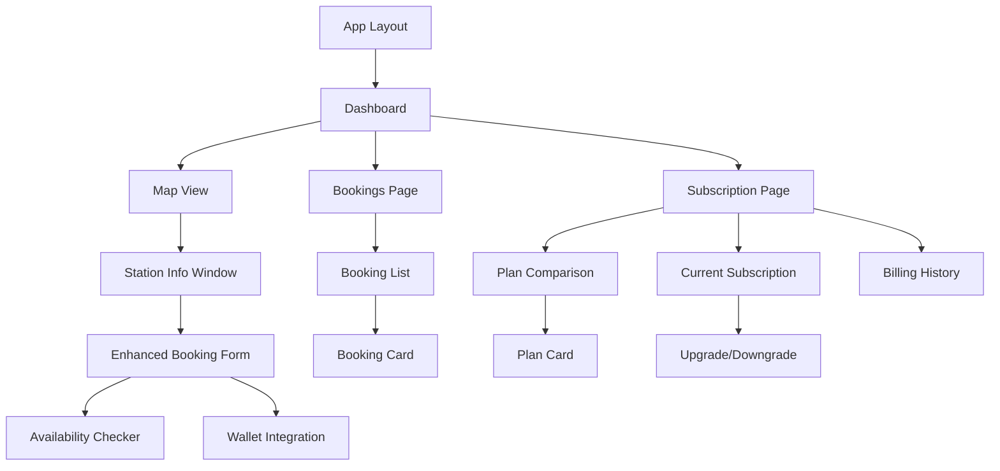

# Design Document

## Overview

This design addresses the completion of connector booking functionality and the implementation of comprehensive subscription management with upgrade/downgrade capabilities. The solution integrates real-time availability checking, wallet-based payments, subscription benefits, and seamless user experience across both booking and subscription workflows. The design ensures proper integration between existing components while adding new subscription management interfaces and enhanced booking capabilities.

## Architecture

### System Integration Architecture



### Component Hierarchy



## Components and Interfaces

### 1. Enhanced Booking System Components

#### BookingForm Component
**Purpose**: Complete booking interface with real-time validation and wallet integration

```typescript
interface BookingFormProps {
  connector: ConnectorResponseDto;
  onBookingSuccess: (booking: BookingResponseDto) => void;
  onCancel: () => void;
  userSubscription?: SubscriptionResponseDto;
}

interface BookingFormState {
  startTime: string;
  endTime: string;
  estimatedEnergy: number;
  isCheckingAvailability: boolean;
  availabilityResult: AvailabilityResult | null;
  walletBalance: number;
  regularPrice: number;
  subscriptionPrice?: number;
  finalPrice: number;
  errors: FormErrors;
}
```

#### AvailabilityChecker Service
**Purpose**: Real-time availability validation with caching

```typescript
interface AvailabilityResult {
  available: boolean;
  conflictingBookings: BookingResponseDto[];
  suggestedTimes: TimeSlot[];
  nearbyAlternatives: AlternativeStation[];
  reason?: string;
}

interface AlternativeStation {
  stationId: string;
  stationName: string;
  distance: number;
  availableSlots: TimeSlot[];
  estimatedCost: number;
}
```

### 2. Subscription Management Components

#### SubscriptionDashboard Component
**Purpose**: Main subscription management interface

```typescript
interface SubscriptionDashboardProps {
  currentSubscription?: SubscriptionResponseDto;
  availablePlans: SubscriptionPlanResponseDto[];
}

interface SubscriptionDashboardState {
  selectedPlan?: string;
  showUpgradeModal: boolean;
  showDowngradeModal: boolean;
  showCancelModal: boolean;
  usageStats: UsageStats;
}
```

#### PlanComparison Component
**Purpose**: Side-by-side plan comparison with upgrade/downgrade options

```typescript
interface PlanComparisonProps {
  plans: SubscriptionPlanResponseDto[];
  currentPlan?: SubscriptionPlanResponseDto;
  onSelectPlan: (planId: string) => void;
  onUpgrade: (planId: string) => void;
  onDowngrade: (planId: string) => void;
}

interface PlanFeature {
  name: string;
  included: boolean;
  limit?: number;
  description?: string;
}
```

#### SubscriptionUpgrade Component
**Purpose**: Handle plan changes with prorated billing

```typescript
interface SubscriptionUpgradeProps {
  currentPlan: SubscriptionPlanResponseDto;
  targetPlan: SubscriptionPlanResponseDto;
  onConfirm: (paymentMethod: PaymentMethod) => void;
  onCancel: () => void;
}

interface UpgradeCalculation {
  proratedCharge: number;
  proratedCredit: number;
  netAmount: number;
  effectiveDate: string;
  nextBillingDate: string;
}
```

### 3. Wallet Integration Components

#### WalletPayment Component
**Purpose**: Unified payment interface for bookings and subscriptions

```typescript
interface WalletPaymentProps {
  amount: number;
  description: string;
  type: 'BOOKING' | 'SUBSCRIPTION' | 'UPGRADE';
  onSuccess: (transaction: WalletTransactionResponseDto) => void;
  onError: (error: PaymentError) => void;
  allowExternalPayment?: boolean;
}

interface PaymentMethod {
  type: 'WALLET' | 'CARD' | 'BANK_TRANSFER';
  details?: Record<string, any>;
}
```

## Data Models

### 1. Enhanced Subscription Models

```typescript
interface SubscriptionPlanResponseDto {
  id: string;
  name: string;
  description: string;
  price: number;
  currency: string;
  billingCycle: 'MONTHLY' | 'QUARTERLY' | 'ANNUAL';
  features: PlanFeature[];
  benefits: SubscriptionBenefit[];
  isActive: boolean;
  isPopular?: boolean;
  tier: 'BASIC' | 'PREMIUM' | 'ENTERPRISE';
  createdAt: string;
  updatedAt: string;
}

interface SubscriptionBenefit {
  type: 'DISCOUNT' | 'PRIORITY_BOOKING' | 'EXTENDED_BOOKING' | 'FREE_CANCELLATION';
  value: number; // percentage for discounts, hours for extensions
  description: string;
}

interface UsageStats {
  bookingsThisMonth: number;
  totalSavings: number;
  averageSessionCost: number;
  benefitsUsed: BenefitUsage[];
}

interface BenefitUsage {
  type: string;
  used: number;
  limit: number;
  resetDate: string;
}
```

### 2. Enhanced Booking Models

```typescript
interface EnhancedBookingRequestDto extends BookingRequestDto {
  paymentMethod: PaymentMethod;
  subscriptionDiscountApplied?: boolean;
  originalPrice: number;
  finalPrice: number;
  vehicleId?: string;
}

interface BookingPricing {
  basePrice: number;
  subscriptionDiscount?: number;
  finalPrice: number;
  currency: string;
  priceBreakdown: PriceComponent[];
}

interface PriceComponent {
  type: 'BASE_RATE' | 'SUBSCRIPTION_DISCOUNT' | 'TIME_MULTIPLIER' | 'TAX';
  amount: number;
  description: string;
}
```

### 3. Payment and Billing Models

```typescript
interface SubscriptionPaymentDto {
  subscriptionId: string;
  amount: number;
  type: 'SUBSCRIPTION_PAYMENT' | 'UPGRADE_CHARGE' | 'DOWNGRADE_CREDIT';
  paymentMethod: PaymentMethod;
  status: 'PENDING' | 'COMPLETED' | 'FAILED';
  billingPeriodStart: string;
  billingPeriodEnd: string;
}

interface ProrationCalculation {
  currentPlanDaysRemaining: number;
  currentPlanDailyRate: number;
  newPlanDailyRate: number;
  creditAmount: number;
  chargeAmount: number;
  netAmount: number;
}
```

## Error Handling

### 1. Booking Error Management

```typescript
enum BookingErrorType {
  AVAILABILITY_ERROR = 'availability_error',
  PAYMENT_ERROR = 'payment_error',
  SUBSCRIPTION_ERROR = 'subscription_error',
  VALIDATION_ERROR = 'validation_error',
  NETWORK_ERROR = 'network_error',
  WALLET_ERROR = 'wallet_error'
}

interface BookingError extends Error {
  type: BookingErrorType;
  field?: string;
  retryable: boolean;
  suggestedAction?: string;
  alternatives?: AlternativeAction[];
}

interface AlternativeAction {
  label: string;
  action: () => void;
  type: 'retry' | 'alternative' | 'topup' | 'contact_support';
}
```

### 2. Subscription Error Management

```typescript
enum SubscriptionErrorType {
  PAYMENT_FAILED = 'payment_failed',
  PLAN_UNAVAILABLE = 'plan_unavailable',
  BILLING_ERROR = 'billing_error',
  PRORATION_ERROR = 'proration_error',
  VALIDATION_ERROR = 'validation_error'
}

interface SubscriptionError extends Error {
  type: SubscriptionErrorType;
  retryable: boolean;
  suggestedActions: string[];
  supportContact?: boolean;
}
```

## Testing Strategy

### 1. Unit Tests

**Booking Components**:
- Test availability checking with various scenarios
- Test wallet integration and payment processing
- Test subscription discount application
- Test error handling and recovery

**Subscription Components**:
- Test plan comparison and selection
- Test upgrade/downgrade calculations
- Test payment method handling
- Test usage statistics display

### 2. Integration Tests

**End-to-End Booking Flow**:
- Test complete booking with subscription benefits
- Test booking with insufficient wallet balance
- Test booking cancellation with refunds
- Test real-time availability updates

**Subscription Management Flow**:
- Test subscription upgrade with prorated billing
- Test subscription downgrade with credits
- Test subscription cancellation
- Test recurring payment processing

### 3. User Experience Tests

**Cross-Feature Integration**:
- Test booking with different subscription tiers
- Test subscription benefits application
- Test payment method switching
- Test error recovery across features

## Implementation Approach

### Phase 1: Complete Booking System
1. Implement real-time availability checking
2. Add wallet integration for booking payments
3. Implement subscription discount application
4. Add comprehensive error handling

### Phase 2: Subscription Management UI
1. Create subscription dashboard components
2. Implement plan comparison interface
3. Add upgrade/downgrade functionality
4. Implement billing history display

### Phase 3: Payment Integration
1. Integrate wallet payments for subscriptions
2. Implement prorated billing calculations
3. Add payment method management
4. Implement recurring payment handling

### Phase 4: Benefits Integration
1. Apply subscription benefits to bookings
2. Implement usage tracking and analytics
3. Add benefit notifications and limits
4. Implement tier-based feature access

### Phase 5: Performance and Polish
1. Implement caching for plans and pricing
2. Add optimistic updates for better UX
3. Implement real-time subscription status updates
4. Add comprehensive analytics and reporting

## Technical Decisions

### 1. Subscription Benefits Application
**Decision**: Apply benefits at booking calculation time with clear pricing breakdown
**Rationale**: Provides transparency and allows users to see value of their subscription

### 2. Payment Method Priority
**Decision**: Prioritize wallet payments with fallback to external methods
**Rationale**: Simplifies user experience while providing flexibility

### 3. Real-time Updates Strategy
**Decision**: Use WebSocket connections for booking and subscription status updates
**Rationale**: Ensures users see immediate updates across all devices

### 4. Proration Calculation
**Decision**: Calculate prorations based on daily rates with transparent breakdown
**Rationale**: Provides fair billing and clear understanding of charges/credits

## Performance Considerations

### 1. Availability Checking
- Implement debounced API calls with 300ms delay
- Cache availability results for 30 seconds
- Use optimistic updates for immediate feedback

### 2. Subscription Data
- Cache subscription plans for 1 hour
- Cache user subscription status for 5 minutes
- Implement background refresh for critical data

### 3. Payment Processing
- Implement retry logic with exponential backoff
- Cache wallet balance with smart invalidation
- Use optimistic updates for payment confirmation

### 4. Real-time Features
- Implement efficient WebSocket connection management
- Use selective data synchronization to minimize bandwidth
- Implement proper connection recovery and reconnection logic