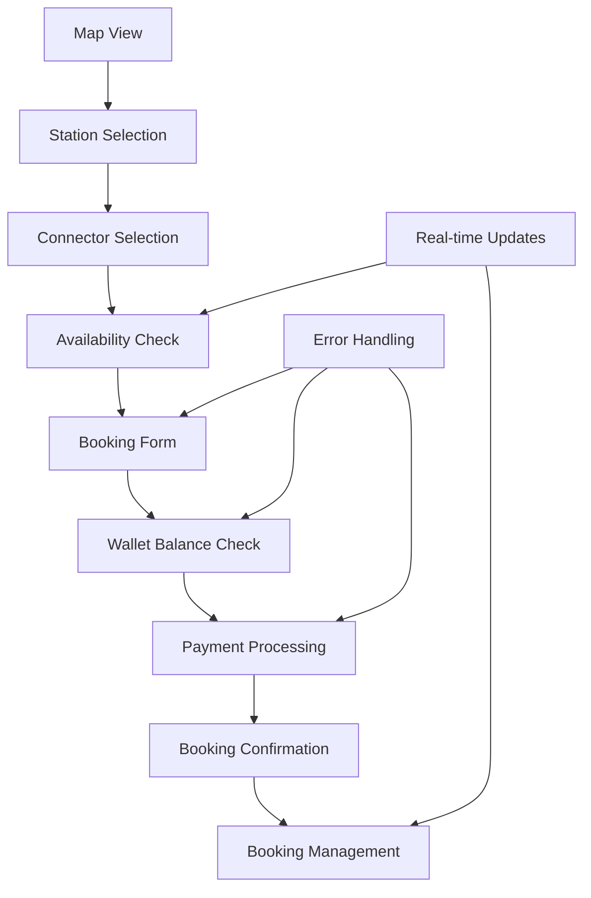
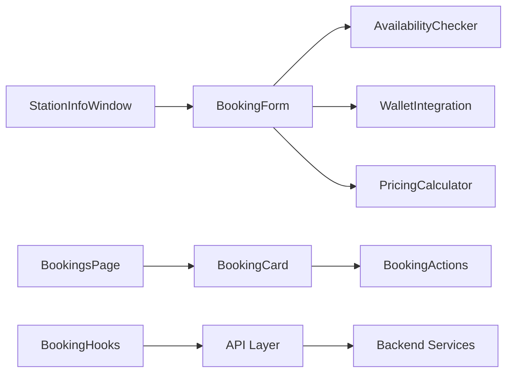

# Design Document

## Overview

This design addresses the completion and enhancement of the booking functionality for charging stations. The solution focuses on fixing existing issues with status handling, implementing wallet-based payments, adding real-time availability checking, and providing a seamless user experience from booking creation to management. The design ensures proper integration between the map view, booking forms, wallet system, and booking management pages.

## Architecture

### Booking Flow Architecture



### Component Integration Pattern



## Components and Interfaces

### 1. Enhanced Booking Form Component

**Purpose**: Provide a comprehensive booking interface with real-time validation

**Key Features**:
- Real-time availability checking
- Wallet balance integration
- Dynamic pricing calculation
- Form validation with helpful error messages

**Interface**:
```typescript
interface BookingFormProps {
  connector: ConnectorResponseDto;
  onBookingSuccess: (booking: BookingResponseDto) => void;
  onCancel: () => void;
}

interface BookingFormState {
  startTime: string;
  endTime: string;
  estimatedEnergy: number;
  isCheckingAvailability: boolean;
  availabilityResult: AvailabilityResult | null;
  walletBalance: number;
  estimatedCost: number;
  errors: FormErrors;
}
```

### 2. Availability Checker Service

**Purpose**: Real-time availability validation and conflict detection

**Key Functions**:
- Check time slot availability
- Detect booking conflicts
- Suggest alternative time slots
- Cache availability results

**Interface**:
```typescript
interface AvailabilityResult {
  available: boolean;
  conflictingBookings: BookingResponseDto[];
  suggestedTimes: TimeSlot[];
  reason?: string;
}

interface TimeSlot {
  startTime: string;
  endTime: string;
  available: boolean;
}
```

### 3. Wallet Integration Component

**Purpose**: Handle wallet balance checks and payment processing

**Key Features**:
- Balance validation
- Payment processing
- Refund handling
- Top-up integration

**Interface**:
```typescript
interface WalletPaymentProps {
  amount: number;
  onPaymentSuccess: () => void;
  onPaymentFailed: (error: string) => void;
  onInsufficientFunds: (shortfall: number) => void;
}

interface PaymentResult {
  success: boolean;
  transactionId?: string;
  error?: string;
  newBalance?: number;
}
```

### 4. Enhanced Booking Management

**Purpose**: Comprehensive booking management with status tracking

**Key Features**:
- Real-time status updates
- Booking modifications
- Cancellation with refunds
- Status-based filtering

**Interface**:
```typescript
interface BookingCardProps {
  booking: BookingResponseDto;
  onCancel: (bookingId: string) => void;
  onModify?: (bookingId: string) => void;
}

interface BookingActions {
  canCancel: boolean;
  canModify: boolean;
  refundAmount?: number;
}
```

## Data Models

### 1. Enhanced Booking Request

```typescript
interface EnhancedBookingRequestDto extends BookingRequestDto {
  paymentMethod: 'WALLET';
  walletId: string;
  pricePerKwh: number;
  estimatedCost: number;
  vehicleId?: string;
}
```

### 2. Booking Status Mapping

```typescript
enum BookingStatus {
  PENDING = 'PENDING',
  CONFIRMED = 'CONFIRMED', 
  ACTIVE = 'ACTIVE',
  COMPLETED = 'COMPLETED',
  CANCELLED = 'CANCELLED'
}

enum ConnectorStatus {
  AVAILABLE = 'AVAILABLE',
  IN_USE = 'IN_USE',
  OFFLINE = 'OFFLINE',
  RESERVED = 'RESERVED'
}
```

### 3. Availability Response

```typescript
interface AvailabilityResponseDto {
  available: boolean;
  conflictingBookings: BookingResponseDto[];
  suggestedTimes: Array<{
    startTime: string;
    endTime: string;
    estimatedCost: number;
  }>;
  nearbyAlternatives?: Array<{
    stationId: string;
    stationName: string;
    distance: number;
    availableSlots: TimeSlot[];
  }>;
}
```

### 4. Payment Transaction

```typescript
interface BookingPaymentDto {
  bookingId: string;
  amount: number;
  walletId: string;
  type: 'BOOKING_PAYMENT' | 'BOOKING_REFUND';
  status: 'PENDING' | 'COMPLETED' | 'FAILED';
  transactionId: string;
}
```

## Error Handling

### 1. Booking Error Classification

```typescript
enum BookingErrorType {
  AVAILABILITY_ERROR = 'availability_error',
  PAYMENT_ERROR = 'payment_error',
  VALIDATION_ERROR = 'validation_error',
  NETWORK_ERROR = 'network_error',
  WALLET_ERROR = 'wallet_error'
}

interface BookingError {
  type: BookingErrorType;
  message: string;
  field?: string;
  retryable: boolean;
  suggestedAction?: string;
}
```

### 2. Error Recovery Strategies

- **Availability Errors**: Show alternative times and nearby stations
- **Payment Errors**: Provide wallet top-up options and retry mechanism
- **Validation Errors**: Highlight specific fields with correction guidance
- **Network Errors**: Implement offline queue and retry with exponential backoff
- **Wallet Errors**: Show balance information and top-up options

### 3. User-Friendly Error Messages

```typescript
const ERROR_MESSAGES = {
  INSUFFICIENT_FUNDS: 'Insufficient wallet balance. Please top up your wallet.',
  CONNECTOR_UNAVAILABLE: 'This connector is no longer available for the selected time.',
  INVALID_TIME_SLOT: 'Please select a valid future time slot.',
  BOOKING_CONFLICT: 'This time slot conflicts with an existing booking.',
  NETWORK_ERROR: 'Connection error. Please check your internet and try again.'
};
```

## Testing Strategy

### 1. Unit Tests

**Booking Form Component**:
- Test form validation with various input combinations
- Test availability checking integration
- Test wallet balance validation
- Test error state handling

**Availability Checker**:
- Test conflict detection logic
- Test alternative time suggestions
- Test caching behavior
- Test error scenarios

**Wallet Integration**:
- Test payment processing flow
- Test insufficient funds handling
- Test refund processing
- Test balance updates

### 2. Integration Tests

**End-to-End Booking Flow**:
- Test complete booking creation from map to confirmation
- Test booking cancellation with refund
- Test booking management page functionality
- Test real-time availability updates

**Payment Integration**:
- Test wallet payment processing
- Test payment failure scenarios
- Test refund processing
- Test balance synchronization

### 3. User Experience Tests

**Booking Scenarios**:
- Test booking during peak hours with limited availability
- Test booking with insufficient wallet balance
- Test booking cancellation within allowed timeframe
- Test booking status updates and notifications

## Implementation Approach

### Phase 1: Fix Existing Issues
1. Fix connector status value mismatches
2. Remove unused code and fix TypeScript errors
3. Standardize status handling across components
4. Implement proper error boundaries

### Phase 2: Enhance Booking Form
1. Add real-time availability checking
2. Implement wallet balance integration
3. Add dynamic pricing calculation
4. Enhance form validation and error handling

### Phase 3: Wallet Payment Integration
1. Implement wallet balance checking
2. Add payment processing for bookings
3. Implement refund handling for cancellations
4. Add insufficient funds handling with top-up options

### Phase 4: Booking Management Enhancements
1. Add real-time booking status updates
2. Implement booking modification capabilities
3. Enhance cancellation flow with refund processing
4. Add booking history and analytics

### Phase 5: Performance and Polish
1. Implement optimistic updates for better UX
2. Add loading skeletons and smooth transitions
3. Implement caching for availability data
4. Add comprehensive error handling and recovery

## Technical Decisions

### 1. Status Value Standardization
**Decision**: Use enum-based status values with proper mapping functions
**Rationale**: Ensures type safety and prevents status mismatch errors

### 2. Real-time Availability
**Decision**: Implement debounced availability checking with caching
**Rationale**: Provides responsive UX while minimizing API calls

### 3. Wallet Integration Strategy
**Decision**: Integrate wallet checks at booking confirmation stage
**Rationale**: Ensures payment validation without blocking the booking flow

### 4. Error Handling Approach
**Decision**: Use classified errors with specific recovery actions
**Rationale**: Provides clear user guidance and improves success rates

## Performance Considerations

### 1. Availability Checking
- Debounce availability requests to prevent excessive API calls
- Cache availability results for short periods
- Use optimistic updates for immediate feedback

### 2. Wallet Balance Updates
- Cache wallet balance with smart invalidation
- Use optimistic updates for payment processing
- Implement background balance synchronization

### 3. Booking Management
- Implement virtual scrolling for large booking lists
- Use pagination for booking history
- Cache booking data with proper invalidation

### 4. Real-time Updates
- Use WebSocket connections for booking status updates
- Implement efficient data synchronization
- Minimize re-renders with proper memoization