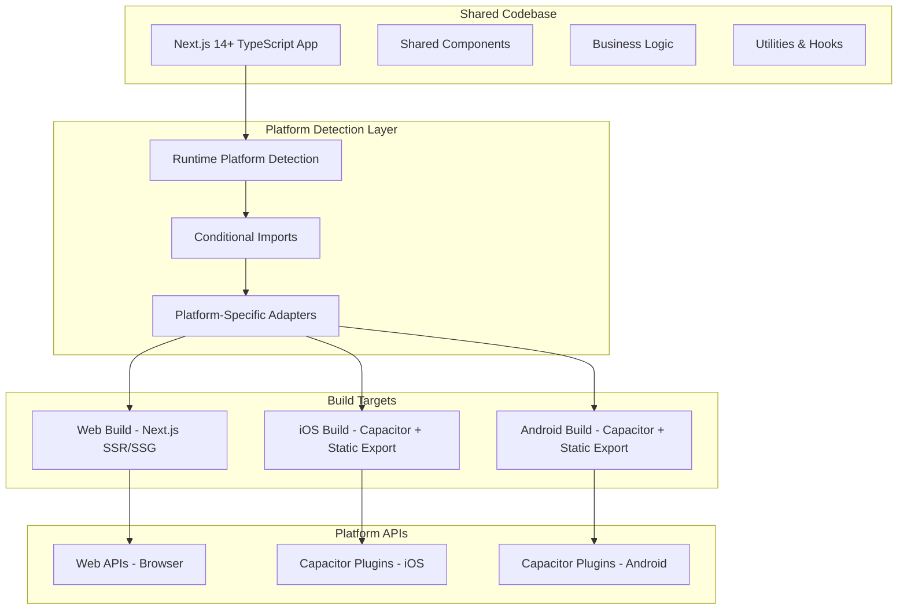
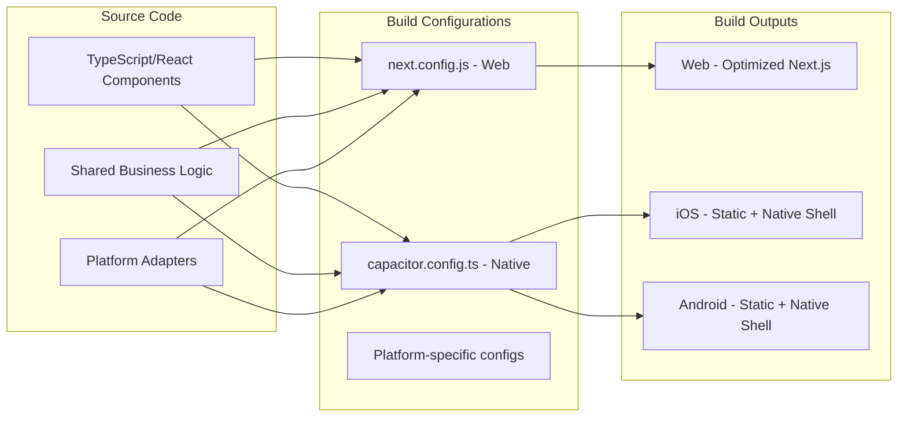
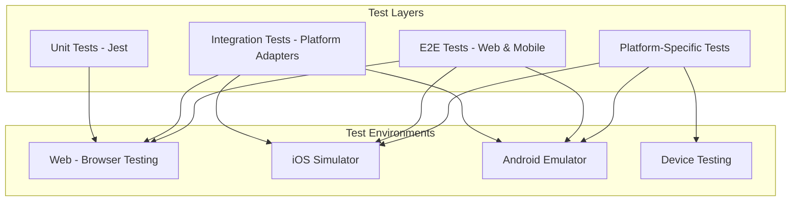

# Design Document

## Overview

This design transforms the existing Next.js TypeScript PowerMaps application into a universal application supporting web, iOS, and Android platforms through a single codebase. The solution leverages Capacitor 5+ as the native wrapper while maintaining Next.js 14+ web functionality, implementing platform detection, conditional logic, and optimized build configurations for each target platform.

The current application is a comprehensive EV charging station finder with features including authentication, real-time station data, maps integration, weather information, and push notifications. The universal design will preserve all existing functionality while enabling native mobile deployment with platform-specific optimizations.

## Architecture

### High-Level Architecture



### Platform Detection Strategy

The architecture implements a runtime platform detection system that determines the execution environment and conditionally loads appropriate implementations:

- **Web Environment**: Standard browser APIs, Next.js SSR/SSG capabilities
- **Native Environment**: Capacitor plugins for device features, static asset serving
- **Hybrid Features**: Graceful fallbacks and progressive enhancement

### Build System Architecture



## Components and Interfaces

### Platform Detection Utilities

```typescript
// Core platform detection interface
interface PlatformDetector {
  isNative(): boolean;
  isWeb(): boolean;
  getPlatform(): 'web' | 'ios' | 'android';
  getCapabilities(): PlatformCapabilities;
}

// Platform capabilities interface
interface PlatformCapabilities {
  hasCamera: boolean;
  hasGeolocation: boolean;
  hasNotifications: boolean;
  hasStorage: boolean;
  hasBiometrics: boolean;
  hasAppState: boolean;
}
```

### Conditional Import System

```typescript
// Dynamic platform-specific imports
interface PlatformAdapter<T> {
  web: () => Promise<T>;
  native: () => Promise<T>;
}

// Storage adapter example
const StorageAdapter: PlatformAdapter<StorageInterface> = {
  web: () => import('./adapters/web-storage'),
  native: () => import('./adapters/capacitor-storage')
};
```

### Universal Component Architecture

```typescript
// Base component with platform awareness
interface UniversalComponent {
  renderWeb(): ReactElement;
  renderNative(): ReactElement;
  getCommonProps(): ComponentProps;
}

// Platform-specific styling
interface PlatformStyles {
  web: string;
  native: string;
  common: string;
}
```

### API Integration Layer

```typescript
// HTTP client abstraction
interface HttpClient {
  get<T>(url: string, config?: RequestConfig): Promise<T>;
  post<T>(url: string, data?: any, config?: RequestConfig): Promise<T>;
  put<T>(url: string, data?: any, config?: RequestConfig): Promise<T>;
  delete<T>(url: string, config?: RequestConfig): Promise<T>;
}

// Platform-specific implementations
class WebHttpClient implements HttpClient { /* axios-based */ }
class NativeHttpClient implements HttpClient { /* Capacitor HTTP */ }
```

## Data Models

### Platform Configuration Model

```typescript
interface PlatformConfig {
  platform: 'web' | 'ios' | 'android';
  apiBaseUrl: string;
  storagePrefix: string;
  enabledFeatures: FeatureFlags;
  buildTarget: 'development' | 'production';
  capacitorConfig?: CapacitorConfig;
}

interface FeatureFlags {
  pushNotifications: boolean;
  biometricAuth: boolean;
  backgroundSync: boolean;
  offlineMode: boolean;
  nativeSharing: boolean;
}
```

### Adapter Registry Model

```typescript
interface AdapterRegistry {
  storage: StorageAdapter;
  notifications: NotificationAdapter;
  geolocation: GeolocationAdapter;
  camera: CameraAdapter;
  sharing: SharingAdapter;
  authentication: AuthAdapter;
}

interface BaseAdapter {
  initialize(): Promise<void>;
  isAvailable(): boolean;
  getCapabilities(): AdapterCapabilities;
}
```

### Build Configuration Models

```typescript
interface WebBuildConfig {
  nextConfig: NextConfig;
  outputMode: 'standalone' | 'static' | 'server';
  optimizations: WebOptimizations;
}

interface NativeBuildConfig {
  capacitorConfig: CapacitorConfig;
  staticExport: boolean;
  bundleOptimizations: NativeOptimizations;
  platformSpecific: {
    ios: IOSConfig;
    android: AndroidConfig;
  };
}
```

## Error Handling

### Platform-Aware Error Handling

```typescript
interface PlatformError extends Error {
  platform: string;
  code: string;
  recoverable: boolean;
  fallbackAction?: () => void;
}

class UniversalErrorHandler {
  handleError(error: PlatformError): void;
  registerFallback(errorCode: string, fallback: () => void): void;
  reportError(error: PlatformError): void;
}
```

### Graceful Degradation Strategy

1. **Feature Detection**: Check platform capabilities before using features
2. **Progressive Enhancement**: Start with basic functionality, add platform-specific features
3. **Fallback Mechanisms**: Provide alternative implementations when features unavailable
4. **User Communication**: Inform users about platform limitations transparently

### Error Recovery Patterns

```typescript
// Retry mechanism for platform-specific operations
interface RetryConfig {
  maxAttempts: number;
  backoffStrategy: 'linear' | 'exponential';
  fallbackToWeb: boolean;
}

// Circuit breaker for unreliable platform features
class PlatformCircuitBreaker {
  execute<T>(operation: () => Promise<T>, fallback: () => Promise<T>): Promise<T>;
}
```

## Testing Strategy

### Multi-Platform Testing Architecture



### Testing Strategies by Layer

#### Unit Testing
- **Shared Logic**: Test business logic independently of platform
- **Platform Adapters**: Mock platform-specific APIs for isolated testing
- **Components**: Test rendering logic with platform context mocking

#### Integration Testing
- **Adapter Integration**: Test platform adapter switching and fallbacks
- **API Integration**: Test HTTP clients across platforms
- **Storage Integration**: Test data persistence across platform storage systems

#### End-to-End Testing
- **Web E2E**: Playwright/Cypress for web application flows
- **Mobile E2E**: Appium for native mobile application flows
- **Cross-Platform**: Shared test scenarios executed on all platforms

#### Platform-Specific Testing
- **iOS Testing**: XCTest integration for native iOS features
- **Android Testing**: Espresso integration for native Android features
- **Device Testing**: Real device testing for hardware-dependent features

### Test Configuration

```typescript
// Jest configuration for universal testing
interface UniversalTestConfig {
  testEnvironment: 'jsdom' | 'node';
  platformMocks: {
    web: MockConfig;
    native: MockConfig;
  };
  setupFiles: string[];
  testPathIgnorePatterns: string[];
}

// Platform-specific test utilities
interface PlatformTestUtils {
  mockPlatform(platform: 'web' | 'ios' | 'android'): void;
  mockCapacitorPlugin(plugin: string, implementation: any): void;
  resetPlatformMocks(): void;
}
```

### Continuous Integration Strategy

1. **Multi-Platform Builds**: Automated builds for all target platforms
2. **Parallel Testing**: Run web and mobile tests concurrently
3. **Device Farm Integration**: Test on real devices in CI/CD pipeline
4. **Performance Testing**: Monitor bundle sizes and performance across platforms
5. **Compatibility Testing**: Ensure backward compatibility with platform versions

The testing strategy ensures reliability across all platforms while maintaining development velocity and catching platform-specific issues early in the development cycle.